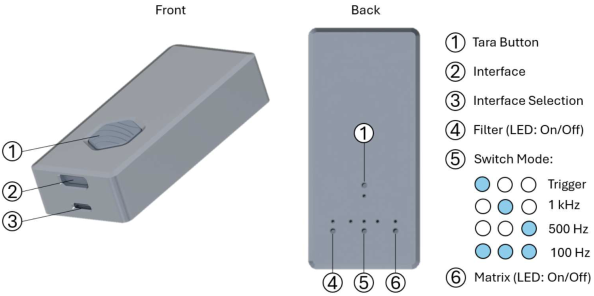

<a href="https://www.etit.tu-darmstadt.de/must/home_must/index.en.jsp"></a>

# ResenseHEX-py

[](https://www.etit.tu-darmstadt.de/must/home_must/index.en.jsp)
[](https://www.python.org/)
[](LICENSE)


Cross-platform **Python** library to read a **Resense HEX32 6-axis Force/Torque sensor** via **USB**.

The Resense evaluation box enumerates as a **USB CDC-ACM serial device**, so the library opens it with [pyserial](https://pyserial.readthedocs.io/) (raw, 8-N-1, 2 Mbaud) and reads the same 28-byte binary frames as our [C++](https://github.com/TUDA-MUST/ResenseHEX-cpp) and [Arduino](https://github.com/TUDA-MUST/ResenseHEX) libraries. The API mirrors those libraries.

> **Please note that this is an unofficial library and that we are not affiliated with the Resense company.** It is provided as-is under the MIT license and follows the public serial protocol used by our (likewise unofficial) [Arduino library](https://github.com/TUDA-MUST/ResenseHEX). "Resense" and "HEX" are trademarks of their respective owner.

## Install

```bash
pip install .                 # from a clone of this repo
# or, for development:
pip install -e .
```

This pulls in `pyserial` and installs a `hex32-read` command-line tool.

## Quick start

```python
from resensehex import ResenseHEX

with ResenseHEX("/dev/ttyACM0") as hex:   # or "COM7" on Windows
    hex.align()                            # find the frame boundary (continuous mode)
    for _ in range(5):
        f = hex.read_frame_and_timestamp()
        print(f"Fz={f.fz:.3f} N  T={f.temperature:.2f} C")
```

Command-line tool:

```bash
hex32-read --quiet                    # prints achieved rate once per second (~1 kHz)
hex32-read --quiet --csv run.csv      # log the stream to CSV
hex32-read COM7 --quiet               # Windows: pass the COM port
hex32-read --tare                     # zero the sensor over USB (or use the hardware button)
```

## Protocol

| Property | Value |
|---|---|
| Baud | 2,000,000 (8-N-1) |
| Frame | 28 bytes = 7 × `float32` little-endian |
| Order | `fx fy fz mx my mz temperature` |
| Units | force N, torque mNm, temp °C |
| Software trigger | `SAMPLE\r\n` → one frame back |
| Tare | `TARA\r\n` |

In **continuous mode** the sensor streams frames with no header byte, so the reader aligns to a frame boundary once (`align()`). In **trigger mode** each `SAMPLE` is answered by exactly one frame, so it self-aligns.

The output rate of continuous mode is set on the sensor (config buttons on the electronics, e.g. 1 kHz); it is not changed over USB.

## Device names

| OS | Example |
|---|---|
| Linux | `/dev/ttyACM0` or `/dev/serial/by-id/usb-Resense_GmbH_HEX_6-axis_FT_Sensor_<serial>-if00` (stable, preferred) |
| macOS | `/dev/cu.usbmodem<...>` |
| Windows | `COM7` (find it in Device Manager → Ports) |

On Linux, the user must be in the `dialout` group:

```bash
sudo usermod -aG dialout $USER   # then re-login
```

## Box settings (buttons on the electronics)

The HEX32 evaluation electronics is configured with the on-board buttons/switch — not over USB. For this library you want **interface = USB** (3) and a **continuous sampling rate** (5); zeroing is the **Tara** button (1).



| ID | Function | Description |
|----|----------|-------------|
| 1 | Tara | 🔵 taring available <br>⚪ taring in process <br> Holding Tara > 20 s enters bootloader mode (box appears as USB storage; drag-and-drop a `.uf2` to flash firmware, then power-cycle). |
| 2 | Interface (Micro-USB) | **USB**: native micro-USB from the internal RP2040 (12 Mbit, full-speed), also supplies 5 V. <br>**UART**: communicate with an external MCU at 2 Mbit (pinout in the manual). |
| 3 | Interface Selection | Switch selects the active interface: <br>⬅️ left = **USB** &nbsp; (use this for this library) <br>➡️ right = **UART** |
| 4 | Filter | Moving average of 10 unweighted samples: <br>🔵 enabled &nbsp; ⚪ disabled |
| 5 | Switch Mode | 🔵⚪⚪ Trigger <br>⚪🔵⚪ **1 kHz** sampling <br>⚪⚪🔵 500 Hz sampling <br>🔵🔵🔵 100 Hz sampling |
| 6 | Matrix | 🔵 output is forces/torques in SI units (N, mNm) <br>⚪ output is raw per-axis signals |

> For continuous reading with this library, set **(3) → USB** and **(5) → 1 kHz** (or 500/100 Hz). Trigger mode on **(5)** pairs with `trigger_and_read()`. The internal **RP2040** is why the box enumerates as a generic USB-serial device (VID `2E8A`) on Windows.

_Image and settings table from our [Arduino library](https://github.com/TUDA-MUST/ResenseHEX) (MIT)._

## API

`ResenseHEX(device, baud=2_000_000, *, read_timeout=0.3, tare_timeout=20.0)` — also a context manager.

| Method | Purpose |
|---|---|
| `open()` / `close()` / `is_open` | lifecycle |
| `read_frame()` / `read_frame_and_timestamp()` | continuous mode (raise `FrameTimeout` / `FrameCorruption`) |
| `align()` | find the frame boundary for continuous streaming |
| `software_trigger()` / `trigger_and_read()` | trigger mode |
| `tare()` / `tare_blocking()` | zero the sensor |
| `send_command(cmd)` / `flush_input()` | low-level helpers |
| `validate_limits(frame)` | check a frame against `max_force` / `max_torque` / `max_temperature` |

`HexFrame` is a dataclass with `fx fy fz mx my mz temperature timestamp` (forces N, torques mNm, temp °C, timestamp = host `time.monotonic()` seconds).

## Notes

- Frames are little-endian `float32`; decoding is a single `struct.unpack("<7f", ...)`.
- The sensor enumerates as a **full-speed** USB device. If it drops off the bus (Linux `dmesg` shows `error -110` / `-62`, the device node disappears), that's a power/cable issue — use a **powered USB hub** and a good cable.
- Taring over USB works, but on a cold / just-reconnected sensor the first `TARA` may have no effect; let it warm up and retry, or use the hardware button.

## See also

- **C++ / USB**: [TUDA-MUST/ResenseHEX-cpp](https://github.com/TUDA-MUST/ResenseHEX-cpp) (Linux/macOS/Windows, same API)
- **Arduino / UART**: [TUDA-MUST/ResenseHEX](https://github.com/TUDA-MUST/ResenseHEX)

## Credits

Independent Python/USB port of the protocol from [TUDA-MUST/ResenseHEX](https://github.com/TUDA-MUST/ResenseHEX) (Arduino, MIT). MIT licensed — see [LICENSE](LICENSE).

This is an **unofficial** project and is **not affiliated with, authorized, or endorsed by Resense**. All trademarks belong to their respective owners.
